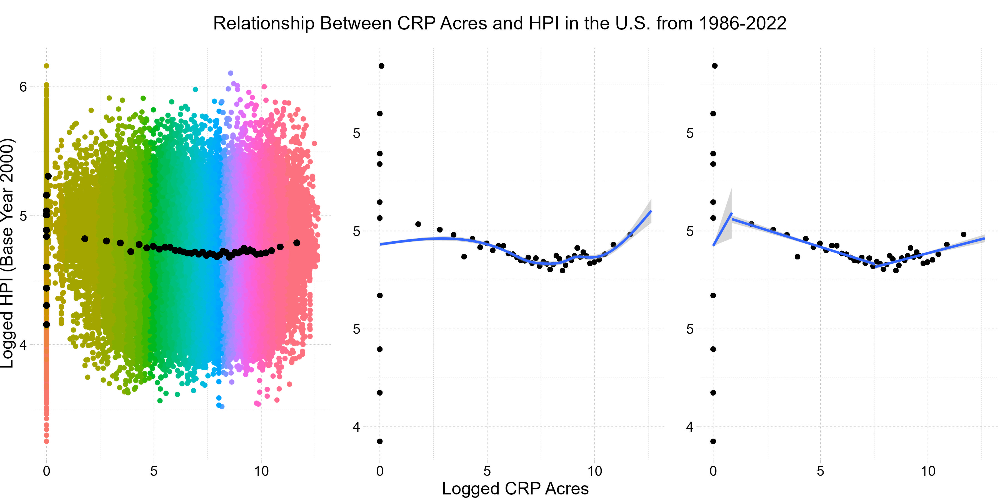

```{r setup, include=FALSE}
library(knitr)
knitr::opts_chunk$set(echo = TRUE)
```

## Topic and Data

### Primary question: How does an increase in conservation easement land affect residential housing prices in the U.S.?

This project looks at the relationship between Conservation Reserve Program (CRP) land and residential housing prices in the U.S.

The Conservation Reserve Program (CRP) "is a land conservation program administered by the Farm Service Agency (FSA). In exchange for a yearly rental payment, farmers enrolled in the program agree to remove environmentally sensitive land from agricultural production and plant species that will improve environmental health and quality. Contracts for land enrolled in CRP are from 10 to 15 years in length. The long-term goal of the program is to re-establish valuable land cover to help improve water quality, prevent soil erosion, and reduce loss of wildlife habitat."

An increase in CRP acres should affect residential housing prices in two ways. First, they decrease the amount of land available for residential development, decreasing supply. Second, consumers may prefer to live in areas with more conservation easements, increasing demand. A decrease in supply and increase in demand should result in an increase in housing prices.

Supply-side: Conservation easements decrease the amount of land available for residential development.

Demand-side: Consumers may prefer to live in areas with more conservation easements.

### Description of Data Sets

#### Conservation Easements

Data on CRP acreage was collected from the ([USDA Farm Service Agency website](https://www.fsa.usda.gov/programs-and-services/conservation-programs/reports-and-statistics/conservation-reserve-program-statistics/index)). The data cover 1986 through 2022, and each observation is measured in the number of acres currently under CRP program rent at the end of the calendar year in each county in the United States. In contrast to some other types of conservation easements, CRP contracts can expire after 10-15 years. It is possible for a total number of conservation acres under the CRP program to go down within a county throughout time.

#### Housing Prices

Residential housing price data was collected from the ([Federal Housing Finance Agency House Price Index](https://www.fhfa.gov/DataTools/Downloads/Pages/House-Price-Index.aspx)). "The FHFA House Price Index (FHFA HPI®) is a broad measure of the movement of single-family house prices in the United States. The HPI is a weighted, repeat-sales index, meaning that it measures average price changes in repeat sales or refinancings on the same properties. This information is obtained by reviewing repeat mortgage transactions on single-family properties whose mortgages have been purchased or securitized by Fannie Mae or Freddie Mac since January 1975." These data cover the years 1975 through 2022, and is measured in dollar value for each county in the U.S., each year. The HPI measurement that I use is standardized to base year 2000.

### Data Processing

#### Cleaning and Transformation
For cleaning, I matched the state variables in both data sets to be all caps and spell out the entire state name instead of the postal code. I made county names all caps as well. I filled in the state for the District of Columbia so that it was not missing, and changed all of the number variables to be numeric variables in R. I made all missing values "NA"s in R. There did not appear to be extreme values outside of the normal data generating process.

Both data sets were fairly clean. I standardized any missing variables to have the "." that R uses, I turned each data set to long/tidy format, and merged on the basis of FIPS county code and year.

I decided to transform both variables for acres of conservation easements and housing price index, to allow for analysis of percent change as well as levels. HPI values were all available and all positive values, so I did not have to make any modifications before transforming those values. However, many measurements for CRP acres were valid values of zero, which could not be logged. I added 1 to every available value of CRP acreage to be able to log that variable. Missing values were kept as NAs.

I transformed several additional measurements of CRP acres and HPI. I calculated the means of each variable by county and by year, and created de-meaned ACRES and HPI variables to later use in analysis with fixed effects.


## Findings and Visualizations

### Finding #1 - HPI increases, decreases, and increases again as time goes on.

In this graph, Housing Price Index observations are grouped by year and then averaged to create a conditional expectation function (CEF). Actual HPI values are represented in the left graph and transformed/logged values are represented on the right. Housing price goes up until about 2007, goes down from about 2007 to 2012, and then goes up again. These data seem to reflect the 2008 housing crisis.

```{r, echo=F}

```

### Finding #2 - CRP acres increase, decrease, and increase again as time goes on.

In this graph, CRP acres are again grouped by year and averaged to create a CEF. Actual CRP acres are represented on the left, and logged acres are represented on the right. Average CRP acres quickly increase from 1986 to about 1992, decrease and then increase even more from 1992 to 2007, and then decline.

```{r, echo=F}

```

### Finding #3 - The spread of CRP acres and HPI increase as time goes on.

This graph shows the relationship between CRP acres and HPI over time. Each dot represents the average CPR acres and average HPI in one state during one year. At the beginning of the data in 1986, most CPR values are between 0 and 50,000. By 2022, CPR values span between 0 and over 200,000. In 1986, HPI values are between approximately 30 and 105. By 2022, they span between 120 and 450. 

```{r, echo=F}
include_graphics("Graphs/finding_3_HPI_ACRES_changing_over_time.gif")
```

### Finding #4 - There is a weak relationship between CRP and HPI. Non-linear estimation suits the data better than linear.

These graphs show the CEF for logged CRP acres to logged HPI. The left-most graph displays a binscatter plot of the data underlying the CEF. The middle graph shows the CEF with a smoothed local regression line. The right-most graph shows the CEF with a least-squares regression line, divided into three distinct sections with three distinct slopes/linear relationships.

```{r, echo=F}

```

These graphs show the CEF for logged CRP acres to logged HPI when accounting for county and year fixed effects. The average CRP acres and average HPI was calculated for each county in the U.S., and then calculated for each year in the U.S. These means were subtracted from the actual observation from each county in each year to find the "de-meaned" values of CRP acres and HPI that reflect including two-way fixed effects in a model.

The left-most graph again displays a binscatter plot of the data underlying the CEF. The middle graph shows the CEF with a smoothed local regression line. The right-most graph shows the CEF with a least-squares regression line, divided into now four distinct sections with four distinct slopes/linear relationships.

```{r, echo=F}

```


## Econometric Analysis

### Methods and Results

I ran four regressions to estimate simple linear regressions and then model the visualizations as closely as possible.

**First regression**: log of ACRES on log of HPI without TWFE. This regression estimates the simple linear effect of a 1% increase in CRP acres on the percentage increase of HPI.

**Second regression**: log of ACRES on log of HPI with county and year TWFE. This regression estimates the simple linear effect of a 1% increase in CRP acres on the percentage increase of HPI, after controlling for county and year fixed effects.

**Third regression**: log of ACRES on log of HPI with polynomials but without TWFE. This regression estimates the non-linear effect of a 1% increase in CRP acres on the percentage increase of HPI. A cubic polynomial is included to most closely match the conditional expectation that appeared to have three distinct sloped areas.

**Fourth regression**: log of ACRES on log of HPI with polynomials and with TWFE. This regression estimates the non-linear effect of a 1% increase in CRP acres on the percentage increase of HPI. A quartic polynomial is included to most closely match the conditional expectation that appeared to have four distinct sloped areas.

### Results

```{r, echo=F}

```

### Findings

CRP acres appear to have a very small effect on HPI. The most basic first regression shows a negative relationship, while regressions 2 through 4 show a positive relationship. The two models with fixed effects, regressions 2 and 4, explain much more of the variation in the data set than the regressions without fixed effects, models 1 and 3. R-squared values jump from about 0.002-0.006 to 0.904-0.905. Adding the quartic polynomials do not affect R-squared as much as I expected, with only a 0.001 difference between regressions 2 and 4. Finally, all calculated coefficients of interest are statistically significant at the 0.001 level.

### Limitations

There are some limitations to these findings.

This is a very good sample of both CRP acres and HPI in the U.S. from 1986-2022. However, a small number of counties never reported CRP acre values during the entire span of the data. This analysis is limited to the counties that were able to report CRP values during 1986-2022.

Additionally, these estimates should not be considered causal due to limitations from omitted variable bias. Many other factors go into the decision for landowners to put acres into the Conservation Reserve Program and/or choose to not renew them that also affect housing prices.

For example, as the economy declines, typically consumers have less leeway with their finances, and may be less likely to put land into conservation reserve programs. Housing prices naturally go down during economic decline as well.

Population growth in certain areas can also affect both variables. If an area suddenly experiences a population boom, land owners could be incentivized to sell their extra land to developers rather than put it into conservation. Housing prices would increase due to population growth.

Finally, environmental changes like natural disasters could contribute to omitted variable bias. If natural disasters increase, there could be an effect on landowners wanting to put additional land into conservation. The change in conservation acres could be different between areas that experienced or are more likely to experience the natural disasters versus areas that are further away. Housing prices may also change depending on location and proximity to natural disasters.

Including two way county and year fixed effects helps mitigate some omitted variable bias, but not all. There could be trends that vary over time within counties that are not captured by fixed effects.
